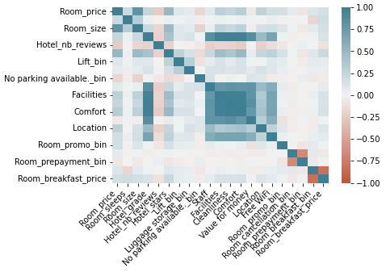
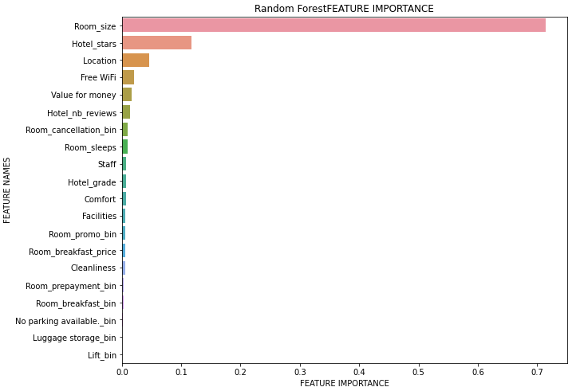
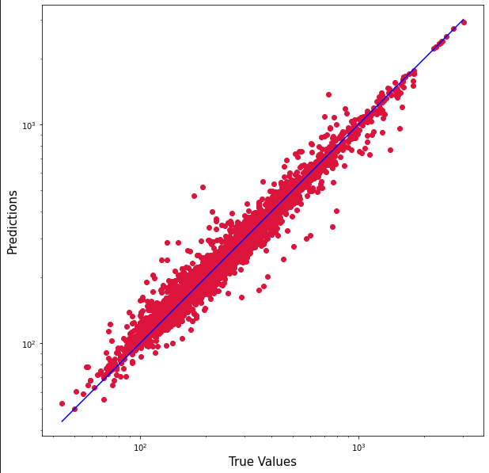
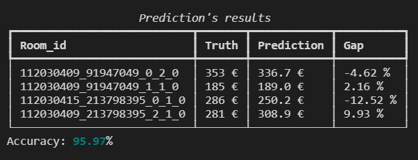

# Booking Hotels Ranking

## Introduction

### Objectives

This project is a machine learning project to predict hotels's rooms prices of [Booking.com](https://www.booking.com/en-gb/) in order to help the consumer in his choices.

Tourism industry is very volatile in terms of prices whether on the destination or the period of the year. Thus, we wanted to express rooms prices' factors with a consumer approach such with a given destination at a given date, the model was able to tell wheter an hotel room is a good (or not) characteritics/price ratio compared the competition at this destination for the same date. The idea is to predict the hotel room's price depending on its characteristics with a model trained on competitors hotels and then to compare this predicted price on the real price given by Booking. If the ratio is positive which means the price predicted by the model is higher than the real price on Booking, we could admit this room is at a low price given its characteristics. The output was to build an app for consumer usage which would compare several hotels' rooms choosed to concurrency at the same destination for the same time period.

### Method

**Application's steps** :
1. Data collection from [Booking.com](https://www.booking.com/en-gb/) on stayed placed `{destination}` and period choose by consumer `{checkin_date}`.
2. Data cleaning and preprocessing to get a dataset ready for machine learning.
3. Models training with hyperparameters optimization, best model selection and comparison of true values to predicted values on given rooms `{room_to_rank}`.

**Command lines launcher** :
 - `py -m main.py {destination} {checkin_date} {room_to_rank}`

## Data collection using Web Scraping

The `scraping.py` file is executed in `main.py` using 2 arguments :

- *destination*
- *checkin_date*

During our entire project, as an example, we choose "Paris" for destination and "15 January 2023" for checkin date.

The app is launched using : `python -m main.py Paris 15 January 2023`

After initialazing Booking's reseach on arguments gave by user, the program naviguates through hotels found and its rooms.

## Descriptive statistics

The json dataset `Booking_Hotels.json` obtained from `scraping.py` is such :

| Variable            | Type  | Description                                            | NA  |
| ------------------- | ----- | ------------------------------------------------------ | ----|
| `Room_id`           | str   | Room's option ID number                                |  /  |
| `Room_name`         | str   | Room name                                              |  /  |
| `Room_price`        | int   | Room price for selected duration                       |  /  |
| `Room_sleeps`       | int   | Room's option total occupancy                          |  /  |
| `Room_promo`        | str   | Room price promotion (square meters)                   |  /  |
| `Room_breakfast`    | str   | Room's option information about breakfast              |  /  |
| `Room_cancellation` | str   | Room's option information about cancellation           |  /  |
| `Room_prepayment`   | str   | Room's option information about prepayment             |  /  |
| `Room_size`         | int   | Room's option size (square meters)                     | 323 |
| `Hotel_id`          | str   | Hotel id                                               |  /  |
| `Hotel_name`        | str   | Hotel name                                             |  /  |
| `Hotel_address`     | str   | Hotel address                                          |  /  |
| `Hotel_grade`       | float | Hotel's booking grade by consumers                     |  7  |
| `Hotel_type`        | str   | Property type (hotel, apartement, guest house ...)     |  /  |
| `Hotel_nb_reviews`  | int   | Hotel's number of consumers' reviews                   |  /  |
| `Hotel_facilities`  | dict  | Hotel's facilities                                     |  /  |
| `Hotel_stars`       | int   | Hotel's number stars                                   |  /  |
| `Hotel_categories`  | dict  | Hotel's grades category (Staff, Comfort, Location ...) |  /  |

Note we had few missing values for `Room_size` and `Hotel_grade` variables which are important for modelization.

Our target variable `Room_prices` distribution :

Note we have a skew normal distribution with the average price $\approx$ 287€ higher than the median price $\approx$ 250€.

Now, let's look at the target variable correlations.

Price is positively correlated with :
- Room size
- Hotel stars number
- Global Booking grade
- Grades per category (facilities, cleanliness, comfort, location)
- Room's number of sleeps

And negatively correlated with :
- Hotel reviews number
- Hotel without parking

## Data preprocessing

The `preprocessing.py` file clean dataset obtained from web scraping by :
- Removing unexpected characters in str varibles.
- Creating new variables from variables obtained.
- Removing missing values with NaN.
- Converting variables types.
- Removing rooms which are not type "Hotel".
- Creating the final dataset for machine learning.

## Machine Learning

The `prediction.py` file use arguments :
- *df* as the cleaned dataset.
- *room_to_rank* the rooms' id list that user wants to compare to competition.

After training on several models, we get the overview :

| Model                            | Train score  | Mean CV score | Dispersion CV score | Best score | Best params    |
| ---------------------------------|--------------|---------------|---------------------|------------|----------------|
| LinearRegression()               |    0.746     |     0.744     |        0.016        |     /      |       /        |
| Lasso()                          |    0.743     |     0.742     |        0.016        |     /      |       /        |
| Ridge()                          |    0.746     |     0.744     |        0.016        |     /      |       /        |
| ElasticNet()                     |    0.746     |     0.744     |        0.016        |   0.744    | {'alpha': 0.015625, 'l1_ratio': 1}        |
| KNeighborsRegressor()            |    0.993     |     0.922     |        0.013        |   0.922    | {'n_neighbors': 2, 'weights': distance}  |
| GaussianProcessRegressor()       |    0.994     |     0.552     |        0.043        |     /      |       /        |
| RandomForestRegressor()          |    0.992     |     0.967     |        0.004        |   0.966    | {'n_estimator': 128, 'max_depth': 50, 'min_samples_leaf': 1,'max_features': "auto"} |
| SVR()                            |    0.601     |     0.571     |        0.007        |   0.571    | {'support_vecteurs__C': 10, 'support_vecteurs__epsilon': 1.0}       |
| MLPRegressor()                   |    0.863     |     0.852     |        0.015        |   0.852    | {'neurones__alpha': 0.001, 'neurones__hidden_layer_sizes': (20, 20)}              |
| BernoulliNB()                    |    0.016     |     0.010     |        0.001        |   0.010    | {'alpha': 0.78}             |
| LogisticRegression()             |    0.011     |     0.008     |        0.002        |   0.009    | {'C': 10.0, 'max_iter': 100, 'penalty': 'l2'}      |
| XGBRegressor()                   |    0.989     |     0.972     |        0.003        |   0.972    | {'learning_rate': 0.07, 'max_depth': 7}               |
| GradientBoostingRegressor()      |              |               |                     |            |                |
| AdaBoostRegressor()              |              |               |                     |            |                |

As we implemented boosting regressors lately, our best model was the random forest one with **96.7%** mean accuracy on cross-validation data.

## Conclusion

### Next steps to implement

- Scraping tags' automation.
- Implement more features to get a more robust model.
- 
